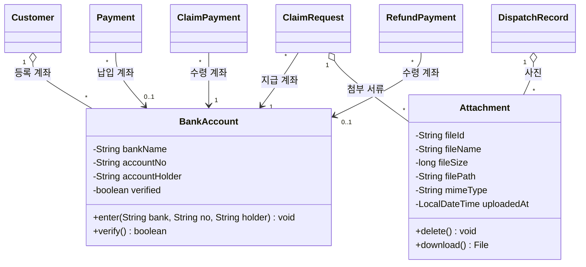
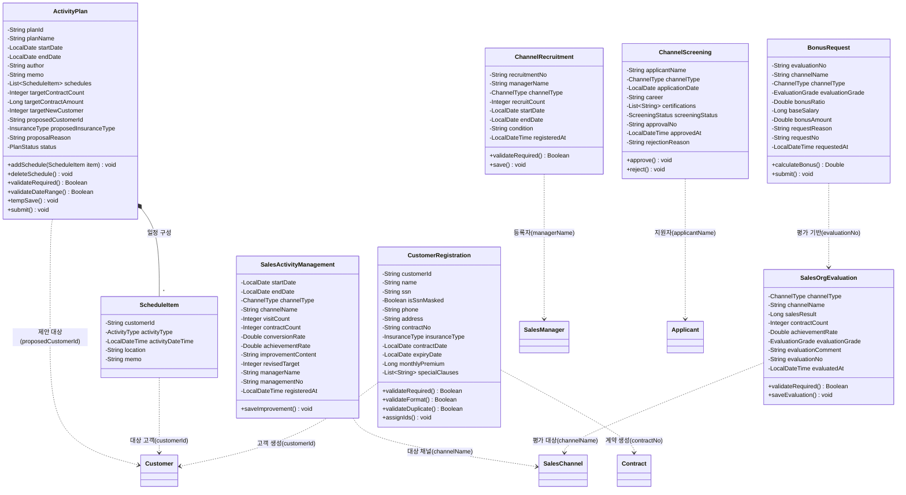
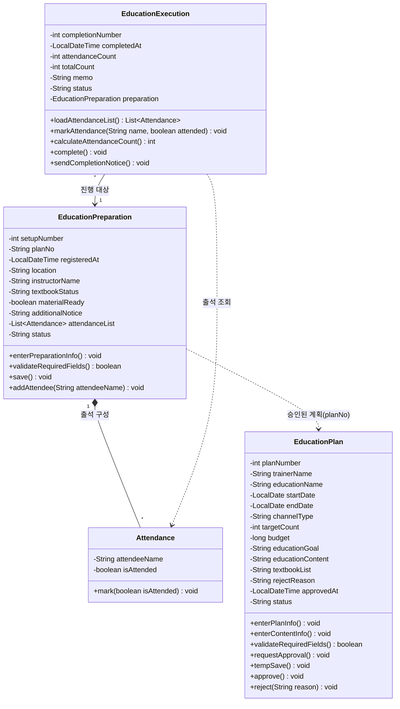
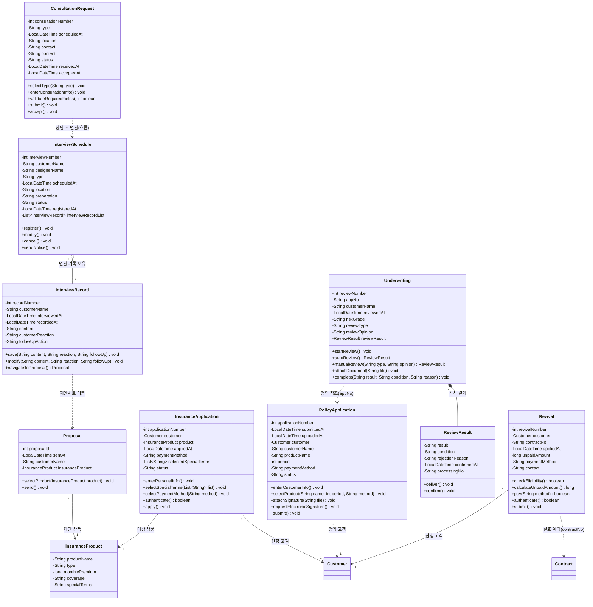
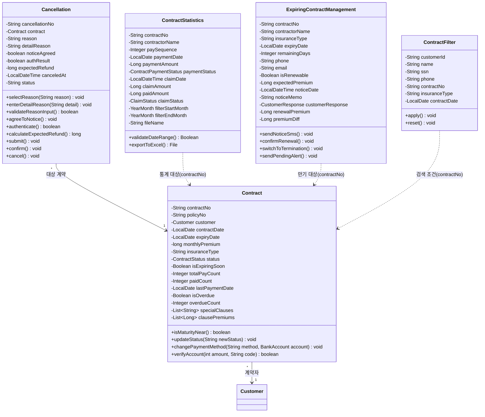
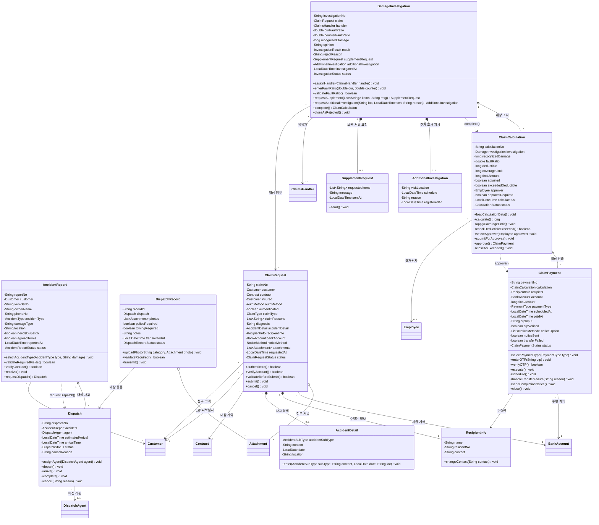
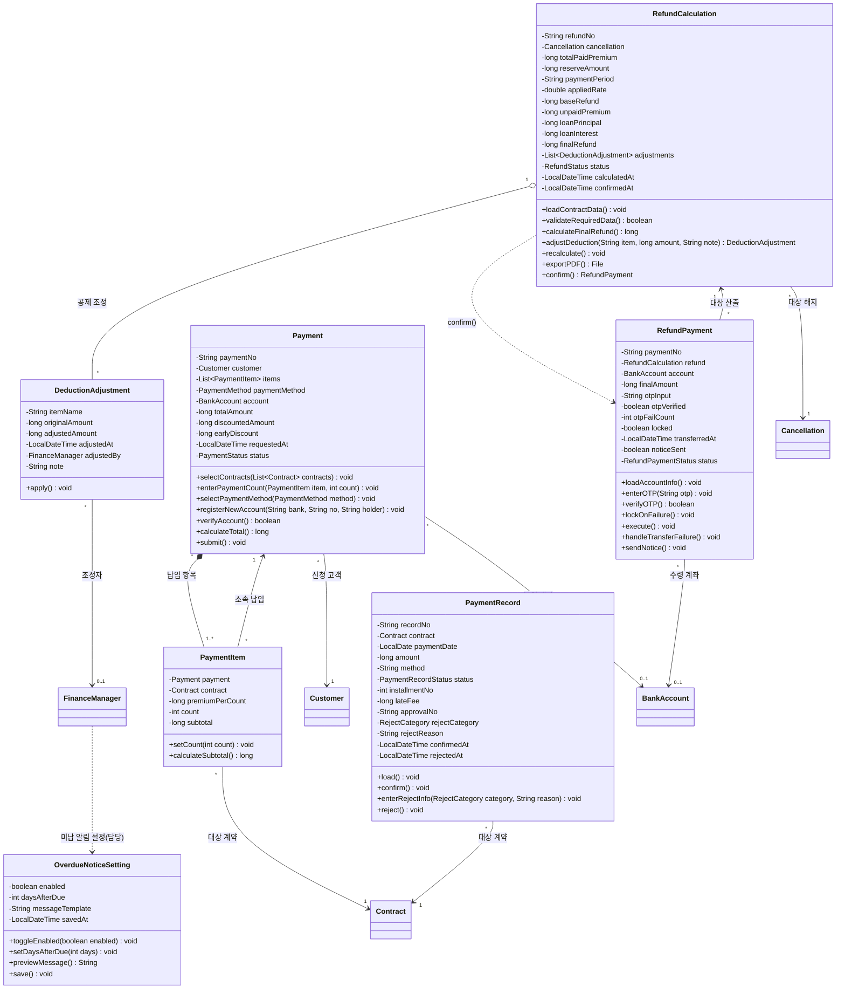
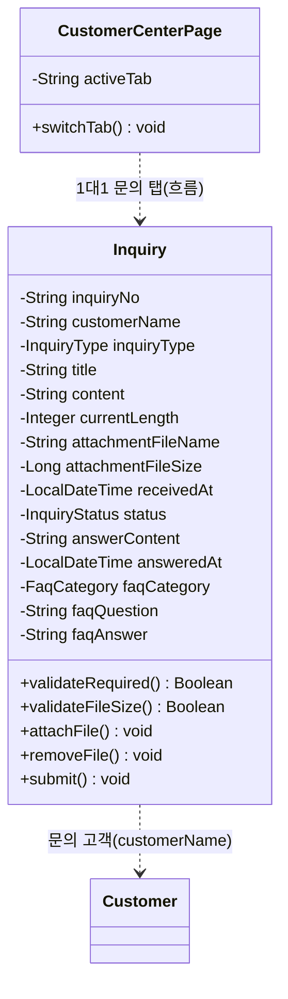
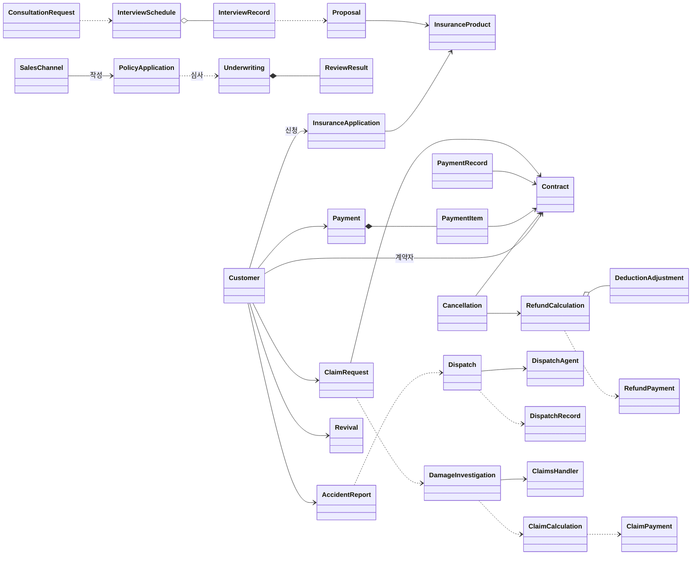

# 보험 시스템 클래스 다이어그램 (Mermaid)

> `Class_Diagram_Domain.md` 를 Mermaid `classDiagram` 으로 옮긴 버전.
> 클래스가 많아 한 장으로 그리면 렌더링이 무거워지므로 **도메인별 다이어그램 + 전체 관계 개요**로 분리한다.
> enum 값은 §0 표를 참조하고, 클래스 다이어그램에서는 속성의 타입명으로만 표기한다.
>
> **관계 표기 (Mermaid)**
> - 상속 `<|--` · 합성 `*--` · 집약 `o--` · 단방향 연관 `-->` · 의존 `..>`
> - 점선 의존 `..>` 은 **실제 객체 참조가 아니라** 메서드 호출 흐름이거나, 문자열 ID/이름(`contractNo`, `channelName` 등)으로만 가리키는 **느슨한 논리 연결**을 뜻한다.

---

## 0️⃣ 열거형 (enum) 참조

| enum | 값 |
|---|---|
| `ChannelType` | DESIGNER, AGENCY |
| `InsuranceType` | LIFE, HEALTH, AUTO, FIRE |
| `ContractStatus` | NORMAL, EXPIRED, CANCELLED, LAPSED |
| `ContractPaymentStatus` | NORMAL, OVERDUE, UNPAID |
| `CustomerResponse` | RENEWAL, TERMINATION, PENDING |
| `PlanStatus` | TEMP_SAVE, UNDER_REVIEW |
| `ScreeningStatus` | PENDING, APPROVED, REJECTED |
| `EvaluationGrade` | S, A, B, C, D |
| `ActivityType` | VISIT, CONSULTATION, CALL |
| `PaymentMethod` | IMMEDIATE_TRANSFER, VIRTUAL_ACCOUNT |
| `PaymentStatus` | DRAFT, COMPLETED, ERROR |
| `PaymentRecordStatus` | WAITING, COMPLETED, REJECTED |
| `RejectCategory` | PAYMENT_ERROR, DUPLICATE_PAYMENT, CONTRACT_MISMATCH, OTHER |
| `RefundStatus` | CALCULATION_PENDING, CALCULATED, PAID |
| `RefundPaymentStatus` | WAITING, COMPLETED, FAILED, LOCKED |
| `AccidentType` | OBJECT, PERSON |
| `AccidentSubType` | GENERAL, TRAFFIC |
| `AccidentReportStatus` | DRAFT, RECEIVED, CANCELED |
| `DispatchStatus` | REQUESTED, ASSIGNED, DEPARTED, ARRIVED, CANCELED, COMPLETED |
| `DispatchRecordStatus` | DRAFT, TRANSMITTED |
| `AuthMethod` | MOBILE, SIMPLE, CERTIFICATE |
| `ClaimType` | DISEASE, ACCIDENT |
| `ClaimRequestStatus` | DRAFT, RECEIVED |
| `ClaimStatus` | PAID, UNDER_REVIEW, REJECTED |
| `NoticeMethod` | KAKAO, SMS, EMAIL, POST, NONE |
| `InvestigationResult` | APPROVED, REJECTED |
| `InvestigationStatus` | NEW_ASSIGNED, INVESTIGATING, INVESTIGATED, CLOSED |
| `CalculationStatus` | CALCULATED, APPROVAL_PENDING, APPROVED, CLOSED |
| `PaymentType` | IMMEDIATE, SCHEDULED |
| `ClaimPaymentStatus` | WAITING, SCHEDULED, COMPLETED, FAILED, CLOSED |
| `InquiryType` | INSURANCE, CLAIM, CONTRACT_CHANGE, CANCELLATION, OTHER |
| `InquiryStatus` | PENDING, ANSWERED |
| `FaqCategory` | ALL, INSURANCE, CLAIM, CONTRACT_CHANGE, CANCELLATION, OTHER |

---

## 1️⃣ 행위자 (actor) 도메인

```mermaid
classDiagram
    direction TB

    class User {
        <<abstract>>
        #String userId
        #String name
        #String contact
        #String email
        +updateProfile(String contact, String email) void
    }
    class Customer {
        -String customerId
        -String phone
        -String residentNo
        -String address
        -LocalDate birthDate
        -List~BankAccount~ registeredAccounts
        -LocalDateTime registeredAt
        +enterAddress(String address) void
        +enterBirthDate(LocalDate date) void
        +registerAccount(BankAccount account) void
        +updateInfo() void
    }
    class Employee {
        <<abstract>>
        #String employeeId
        #String department
        #String position
        #LocalDate hireDate
    }
    class SalesChannel {
        -String channelId
        -String channelName
        -ChannelType channelType
        +acceptConsultation(ConsultationRequest request) void
        +createPolicyApplication() PolicyApplication
        +getActivityDetail() void
    }
    class Designer {
        -String licenseNumber
    }
    class Agency {
        -String agencyNumber
    }
    class SalesManager {
        -String managerId
        -String name
        -String department
        +approveEducationPlan(EducationPlan plan) void
        +rejectEducationPlan(EducationPlan plan, String reason) void
    }
    class EducationTrainer {
        +createEducationPlan() EducationPlan
        +registerEducationPreparation() EducationPreparation
        +conductEducation(EducationPreparation prep) EducationExecution
    }
    class InsuranceReviewer {
        +startUnderwriting(PolicyApplication app) Underwriting
        +deliverReviewResult(ReviewResult result) void
    }
    class ClaimsHandler {
        -long transferLimit
    }
    class DispatchAgent {
        -String region
        -String vehicleNo
    }
    class FinanceManager {
    }
    class ContractManager {
        -String managerId
        -String name
        -String department
    }
    class Applicant {
        -String applicantId
        -String name
        -ChannelType channelType
    }
    class BankAccount {
        -String bankName
        -String accountNo
        -String accountHolder
        -boolean verified
        +enter(String bank, String no, String holder) void
        +verify() boolean
    }

    User <|-- Customer
    User <|-- Employee
    Employee <|-- EducationTrainer
    Employee <|-- InsuranceReviewer
    Employee <|-- ClaimsHandler
    Employee <|-- DispatchAgent
    Employee <|-- FinanceManager
    SalesChannel <|-- Designer
    SalesChannel <|-- Agency

    Customer "1" o-- "*" BankAccount : 등록 계좌
    SalesChannel ..> ConsultationRequest : 수락
    SalesChannel ..> PolicyApplication : 생성
    SalesManager ..> EducationPlan : 승인/반려
    EducationTrainer ..> EducationPreparation : 생성
    InsuranceReviewer ..> Underwriting : 심사
    ContractManager ..> Contract : 계약 조회/편집(담당)
    ContractManager ..> ContractStatistics : 통계 관리(담당)
    ContractManager ..> ExpiringContractManagement : 만기 관리(담당)
    ChannelScreening ..> Applicant : 채용 심사 대상
```

> ※ `SalesManager`, `ContractManager`, `SalesChannel`, `Applicant` 는 `User`/`Employee` 를 상속하지 않는 독립 클래스이다.

---

## 2️⃣ 공통 (common) 도메인

> `Attachment` / `BankAccount` 는 여러 도메인이 공유하는 부품 클래스다. 위 다이어그램은 **이 부품을 객체로 보유하는 사용처**를 모아 보여준 것이고, 동일한 관계가 각 도메인 다이어그램(§1·§7·§8)에도 표기된다.

---

## 3️⃣ 영업 (sales) 도메인

> 영업 도메인 클래스 대부분은 채널명·관리자명 등을 **문자열로 보관**하며 actor 클래스를 직접 참조하지 않는다. 점선(`..>`)은 그 문자열이 논리적으로 가리키는 대상을 표시한 것이다.

---

## 4️⃣ 교육 (education) 도메인

> `EducationPlan` → `EducationPreparation` 은 `planNo`(String) 로 느슨하게 연결된다(객체 참조 아님 → 점선 `..>`).

---

## 5️⃣ 상담/면담/청약/심사 (consultation) 도메인

> `Underwriting`→`PolicyApplication`, `Revival`→`Contract` 등은 `appNo`·`contractNo`(String) 로 느슨하게 연결된다.

---

## 6️⃣ 계약 (contract) 도메인

> `ContractStatistics` / `ContractFilter` / `ExpiringContractManagement` 는 `contractNo`(String) 와 화면 데이터로 계약을 보관하며 `Contract` 객체를 직접 참조하지 않는다(점선 `..>` 으로 논리적 대상만 표시).

---

## 7️⃣ 사고/현장출동/보험금 (claim) 도메인

---

## 8️⃣ 납입/환급 (payment) 도메인

> `OverdueNoticeSetting` 은 다른 도메인 객체를 필드로 참조하지 않는 **시스템 단위 설정값**이라, 재무회계 담당자(`FinanceManager`)가 설정한다는 점선(담당)으로만 연결된다.

---

## 9️⃣ 문의 (inquiry) 도메인

> `Inquiry` 는 답변·FAQ 를 자체 필드로 보관하며 별도 Answer/FAQ 클래스를 두지 않는다.

---

## 🎯 전체 관계 개요 (도메인 간 핵심 흐름)

> 속성/메서드는 생략하고 도메인 간 주요 연관·생성 흐름만 표현한다.

